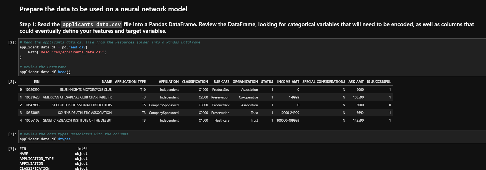
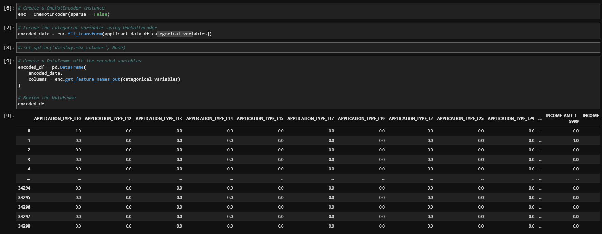
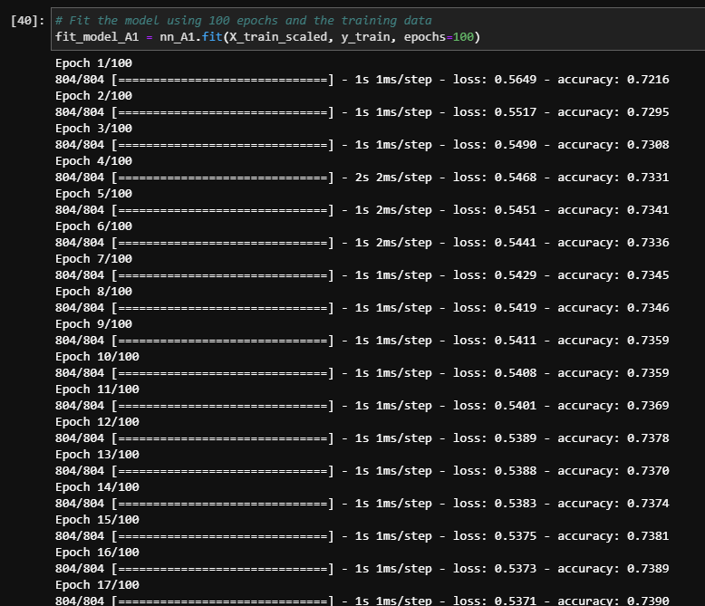
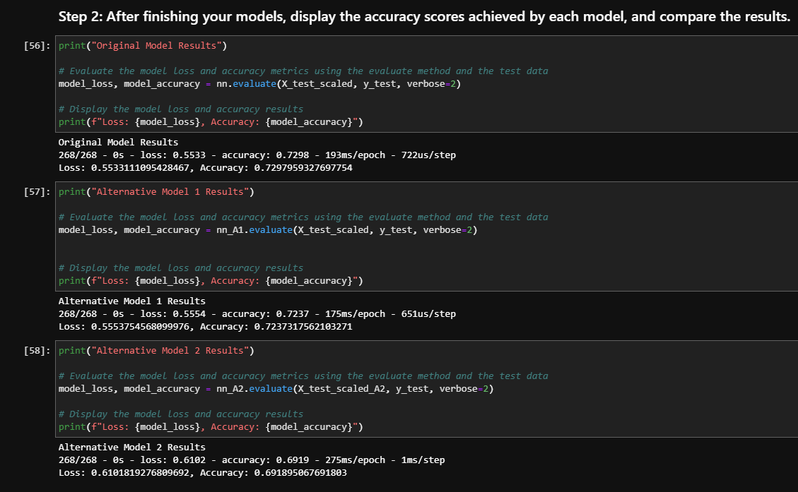
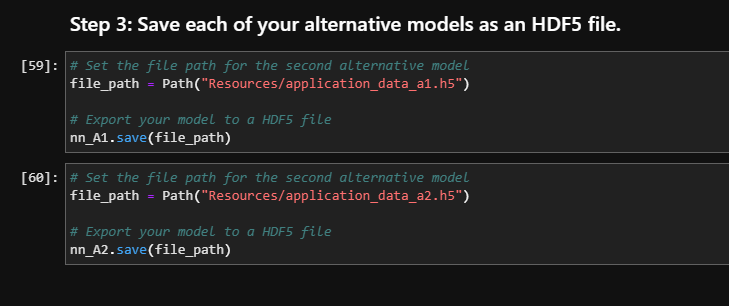

<!-- header is made with: https://github.com/kyechan99/capsule-render -->

 
Columbia FinTech Bootcamp Assignment - Module 13

---

### Table of Contents
* [Overview](#overview)
* [Requirements](#requirements)
* [Data](#data)
* [Visualization](#visualization)
* [License](#license)

---

## Overview

In this program, a model that predicts whether applicants will be successful if funded by Alphabet Soup was created. The CSV file used contains more than 34,000 organizations that have received funding from Alphabet Soup over the years to work with. With the knowledge of machine learning and neural networks the following was performed...

* Prepare the data for use on a neural network model.

* Compile and evaluate a binary classification model using a neural network.

* Optimize the neural network model.
 
---

## Requirements

This project leverages python 3.7, scikit-learn, TemsorFlow and Keras.

A [conda](https://docs.conda.io/en/latest/) environment with liabraries listed below and [Jupyter Notebook/Lab](https://jupyter.org/) are required to run the code.

The following libraries were used:

1. [TensorFlow 2.0](https://www.tensorflow.org/) - The core open source library to help you develop and train ML models.
2. [Scikit Learn](https://scikit-learn.org/stable/index.html) - Scikit Learn or Sklearn is one of the most used Python libraries for Data Science, along with others like Numpy, Pandas, Tensorflow, or Keras.

Install the following librarie(s) in your terminal...

    pip install -U scikit-learn
    pip install --upgrade tensorflow

---

## Data Used

The data used in this neural network model was from derived from a CSV file called applicants_data.csv.:

---

## Sample Visualization

Uploading and reading the .csv file

Creating a OneHotEncoder instance

Fitting the model using 100 epochs and the training data

Displaying the accuracy scores achieved by each model and comparing the results

Saving alternative models as an HDF5 file.

---

## License

MIT

